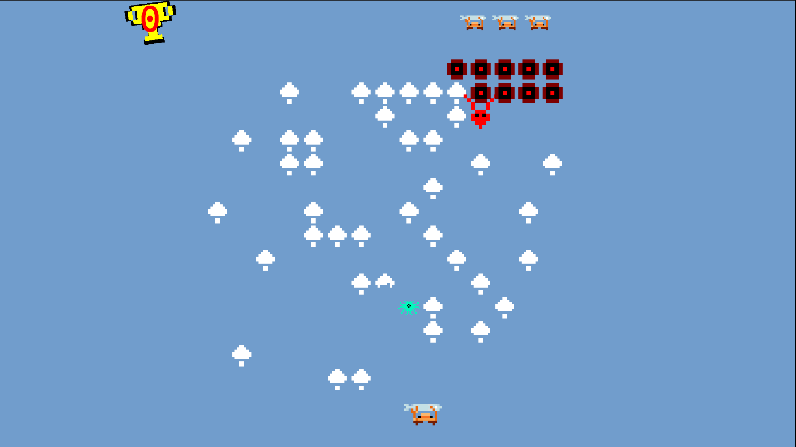

## Description
Centipede is a 1981 fixed shooter arcade game developed and published by Atari, Inc. Designed by Dona Bailey and Ed Logg, it was one of the most commercially successful games from the golden age of arcade video games and one of the first with a significant female player base. The primary objective is to shoot all the segments of a centipede that winds down the playing field.  

The wiki page describing the original game is located [here](https://en.wikipedia.org/wiki/Centipede_(video_game)).  
[Here](https://github.com/cholushkin/Centipede/tree/crab) is a branch with crab holding fish version :)
  
This Unity project is a quick remake of the original game. Could be a starting point of different remakes of Centipide game.

  

Starting scene is Assets/Game/Scenes/Game.unity

## Contributing
If you wish to contribute there are bunch of things to do:
* :space_invader: flea monster from original game
* Sound effects
* Anything you would like to add :)

If you wish to contribute I am happy to see your pull requests! :)
